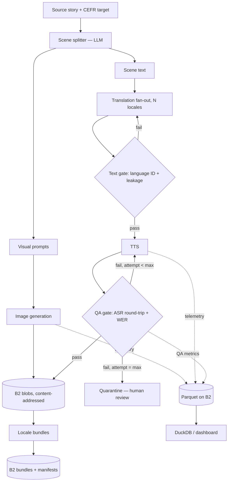

# Polyglo

> Localization QA is still humans listening to every audio file. We made it a
> pipeline stage.

Built for the [Backblaze Generative Media Hackathon](https://backblaze-generative-media.devpost.com/).

**[Live demo](https://polyglo.onrender.com/)** &middot; **[3-minute demo video](#)** — *video link
added at submission, see [docs/05-SUBMISSION-KIT.md](docs/05-SUBMISSION-KIT.md) for the checklist*

## What it does

One source story, one CEFR level, one click. Polyglo first corrects spelling/grammar
and genuinely re-levels the source text for the target CEFR (both the as-submitted
and corrected versions stay visible — nothing is silently rewritten), splits the
result into scenes, generates each scene's illustration **exactly once**, then fans
out to every target locale: translates the text, narrates it, and — the
differentiator — **verifies the narration automatically** by transcribing the
generated audio back and diffing it against the text that produced it. A segment
that fails is retried on a different voice, escalated to a stronger model, and
quarantined for human review only if every attempt fails. Image generation and
narration each run as a real Genblaze `Pipeline` producing a hash-verified manifest,
persisted to Backblaze B2.

The product bet: comprehensible-input content in 20 languages currently means 20x the
translation cost and, worse, 20x the QA burden — and that QA step is still manual.
Automating the "does this audio actually say what it's supposed to say" check is the
part nobody has productized.

## Feature list

**Authoring**
- Spelling/grammar autocorrect plus genuine CEFR re-levelling (A1–C2), with the
  original and corrected text both shown rather than one silently replacing the other.
- **Magic Draft** — generate a source story from scratch if you don't have one.
- Scene splitting into per-scene text plus a visual prompt.

**Generation**
- Scene illustrations generated **once per story** and shared across every locale by
  SHA-256, never redrawn per language.
- Cross-scene character consistency via real image-to-image reference conditioning, so
  the same character and art style persist from scene to scene.
- Translation fan-out to 8 built-in locales (en-US, es-ES, fr-FR, de-DE, it-IT, pt-BR,
  hi-IN, ja-JP).
- Real TTS narration per locale, with a cross-vendor fallback chain.

**Verification — the centrepiece**
- Cross-modal QA gate: TTS → ASR round trip → text normalization → Word Error Rate →
  pass / retry-on-another-voice / escalate-to-a-stronger-model / quarantine.
- Text gate catching wrong-language output and untranslated source leakage before
  audio is ever generated.
- Numeral expansion so "3" and "tres" compare equal, including a hand-verified Hindi
  0–100 lookup table.
- Rate-limit awareness: a provider 429 is recorded as an error, not scored as a
  content-quality failure, so a quota problem never masquerades as a bad narration.
- Per-segment retry history surfaced in the UI as the evidence the gate does real work.

**Storage and provenance**
- Content-addressed blob store on B2 — every asset keyed by the SHA-256 of its own bytes.
- Live dedup measurement (`COUNT(*)` vs `COUNT(DISTINCT sha256)`), not an assertion.
- Hash-verified Genblaze manifests, with a `/verify` page that re-checks any manifest's
  own hash and every declared output checksum.
- Parquet telemetry lake on B2, queried live with DuckDB.
- SQLite index snapshotted to B2 so story history survives an ephemeral-disk redeploy.

**Interface**
- Server-rendered UI with an htmx-polling locale matrix, per-locale flags and QA status.
- WER diff panel showing exactly which words drifted.
- Progress stepper over SSE for in-flight runs.
- Dedicated per-locale reader view with scene art and audio playback.
- Dashboard: dedup ratio, QA outcomes, retry evidence, per-model latency and failures.
- **Chaos toggle** — switch a model off from the dashboard and watch the fallback chain
  recover in real time. Available as a UI panel and as `POST /api/chaos/{model}/disable`.
- Dark mode.

**Export**
- Narrated MP4 per locale: scene images with Ken Burns motion panning, real narration
  audio, and burned-in subtitles where the ffmpeg build supports them.
- Square (1:1) and vertical reel (9:16) output formats.
- Per-scene image download.

**Production hardening**
- Per-IP sliding-window rate limits on story creation (5/10min), chaos toggling
  (30/min) and video export (3/5min), shared across the HTML and JSON routes so you
  can't dodge a cap by switching interface.
- Global daily story cap plus per-vendor daily call budgets (Gemini, OpenRouter).
- Video encode concurrency capped at 1, with a fast 503 instead of a queued wait.
- Structured logging, GitHub Actions CI, and a Docker image verified with `--no-cache`
  rebuilds.
- Zero-credential mode that produces real bundles rather than crashing or emitting
  empty output.

## Architecture



The load-bearing design decision: **images are generated once and referenced by every
locale bundle via SHA-256.** Audio is the only per-locale artifact. Storage grows with
`locales × audio`, never `locales × (audio + images)` — measured on a real run (4
scenes × 4 locales, real NVIDIA image generation): **32 asset references → 20 unique
blobs, 37.5% deduplicated**, entirely from the 4 scene images being shared instead of
duplicated per locale. The dashboard computes this live from the same Parquet
telemetry for any run, not just this one.

Full design rationale in [`docs/01-PRODUCT-DESIGN.md`](docs/01-PRODUCT-DESIGN.md) and
[`docs/02-TECHNICAL-ARCHITECTURE.md`](docs/02-TECHNICAL-ARCHITECTURE.md).

## How we use Backblaze B2

- **Content-addressed blob store** (`polyglo/store.py`) — every asset (image, audio)
  keyed by its own SHA-256 hash. Writing identical bytes twice is a no-op; this is what
  makes the locale-sharing dedup real and measurable rather than asserted. The dedup
  figure is `COUNT(*)` versus `COUNT(DISTINCT sha256)` on the `bundle_refs` table.
- **Real, verified upload** — `B2Backend` talks to B2 over the S3-compatible API via
  `boto3`. Confirmed working end-to-end against a live bucket, not just against mocks.
- **Genblaze's own Parquet telemetry lake**, written alongside every real pipeline run
  (`runs` / `steps` / `assets` tables from `ParquetSink`, plus our own `qa` table
  tracking every QA-gate attempt). Queried live with DuckDB — the dashboard's dedup
  ratio, QA effectiveness, retry evidence, and per-model cost/latency figures are all
  computed from this data, not hand-typed.
- **Bucket configured with Object Lock enabled** and SSE-B2 encryption — the capability
  for cryptographically immutable, approved bundles is in place (`ObjectLockConfig` is
  a one-line `ObjectStorageSink` argument), even though this build doesn't yet apply
  retention to specific approved manifests.
- Bundles reference blobs **by hash, not by copy** — trivially provable by listing the
  bucket and comparing reference counts to unique object counts.
- **The story/scene SQLite index is itself backed up to B2**
  (`db-snapshot/<env>/polyglo.db`, written after every pipeline run) — the deployed
  container's local disk is ephemeral (Render resets it on every redeploy), so this is
  what lets the app come back with its full story history intact rather than starting
  from zero, without needing a second storage backend. Verified live: created a story in
  one container, killed it entirely, and a brand-new container with no shared state
  showed the story immediately on startup — restored automatically from this B2
  snapshot. The key is scoped by `POLYGLO_ENV` (default `dev`, production sets `prod`)
  because a single fixed key meant local runs overwrote the snapshot the deployed
  instance restores from — a real incident, not a hypothetical one. Blobs are
  content-addressed and were never at risk; only the index was.

## How we use Genblaze

- Image generation and narration each run through a real `Pipeline().step().run()`
  call, producing a genuine, hash-verified `Manifest` (`polyglo/pipeline.py` wraps this
  so the rest of the app never touches Genblaze directly). The text steps — authoring,
  scene splitting, translation — call the chat helper directly, since they produce story
  structure rather than an asset that needs a manifest.
- **`fallback_models=[...]`** fallback chains are wired into both the visual and
  narration providers, alongside our own cross-*provider* fallback (a different vendor
  entirely, not just a different model at the same one). A live "chaos" toggle
  (`POST /api/chaos/{model}/disable`, plus a dashboard panel) forces a model to fail on
  demand, so fallback recovery is demonstrable on camera rather than depending on a real
  outage.
- **`ObjectStorageSink` + `S3StorageBackend.for_backblaze()`** persists real pipeline
  runs to B2; a plain, reusable `ParquetSink` writes the telemetry lake the dashboard
  reads. Note `ObjectStorageSink` is single-use — its `close()` fires in a `finally`
  block when a run finishes, so it must be built fresh per run. A bare `ParquetSink` is
  not.
- **Manifest verification** (`manifest.verify()`) is exposed directly in the UI: drop a
  manifest JSON sidecar into the `/verify` page and get a pass/fail on its hash and
  every output asset's declared checksum.
- Where real NVIDIA generation is unavailable (audio — see Limitations), narration runs
  through Gemini or OpenRouter for real playable audio rather than falling back to
  simulated bytes — that path also runs through a **real** `Pipeline`
  (`genblaze_core.mocks.MockProvider` seeded with the real generated bytes, the same
  technique `SimulatedNarrator`/`SimulatedVisualGenerator` already used), so it still
  produces a genuine, hash-verified Genblaze manifest. `SimulatedNarrator` itself is
  only reached with zero credentials at all.

## The QA gate

Generate narration → transcribe it back with a **different** model family than the one
that generated it → diff against the source text (Levenshtein word alignment) → score
as Word Error Rate:

| WER | Verdict |
|---|---|
| ≤ 0.10 | Pass |
| 0.10 – 0.25 | Retry on an alternate voice |
| > 0.25 | Escalate to a stronger model, then quarantine if still failing |

These thresholds are reasonable but **not formally calibrated** against a real
distribution yet — no real sample has contradicted them, and we'd rather say that than
imply a calibration we haven't done.

Every attempt is recorded — the retry history (visible per-segment in the story detail
view) is the actual evidence the gate does real work, not a pass-through. Real observed
outcomes include a clean 0.0 exact match, an escalate-then-recover (1.0 → 0.0 on
`voice-strong`), and a real 3-word narration that lost one word, scored WER 0.333,
retried on two different voices and was correctly quarantined when none cleared
threshold.

One diagnostic worth knowing: a quarantine with `wer=None` means a **provider error**,
not a quality failure. Conflating the two makes a gate lie about your content.

**What this gate does and does not prove — stated precisely, because the distinction
matters.** The gate transcribes the generated audio and diffs it against *the
translated text that was fed to TTS*. So it verifies the **text-to-speech round
trip**: that the audio actually says the words it was given. It does **not** verify
that those words are a correct translation of the source. A perfect WER score is
entirely consistent with fluently narrating a bad translation.

That is a real boundary, not a hedge, so here is where the line falls:

| Failure | Caught? | By what |
|---|---|---|
| Dropped / truncated words, silence | ✅ | WER diff |
| Mispronunciation severe enough to change words | ✅ | WER diff |
| TTS emitting the wrong language entirely | ✅ | `text_gate.py` language-ID |
| Source text leaking through untranslated | ✅ | `text_gate.py` leakage check |
| **Fluent but semantically wrong translation** | ❌ | **not scored — next stage, not a solved one** |
| Unnatural prosody, cultural inappropriateness | ❌ | out of scope |

So the honest claim is narrower than "we made localization QA a pipeline stage": we
made **the TTS-verification half** of it a pipeline stage. That half is real,
currently manual in industry, and the expensive-to-automate part we chose first.
Translation-accuracy scoring (back-translation + semantic similarity, or an
LLM-as-judge rubric) is the obvious next stage and is deliberately not claimed here.

The WER technique itself is known from TTS evaluation research (PCTS, percentage of
completely correct transcribed sentences) — the contribution is putting it inside a
production pipeline as a *blocking* gate with a real retry/escalate/quarantine state
machine, not inventing the metric.

## AI providers and models

| Stage | Provider and model | Cost | Notes |
|---|---|---|---|
| Authoring, CEFR grading, scene splitting, translation | NVIDIA NIM `meta/llama-3.1-8b-instruct` | Free tier | Confirmed live against the real API |
| Image generation, primary | NVIDIA NIM `black-forest-labs/flux.1-dev` | Free tier | Confirmed live: real 200 OK, verified JPEG. 75s timeout, cut from 180s after telemetry showed 39s average / 60s p95 |
| Image generation, cross-provider fallback | OpenRouter `bytedance-seed/seedream-4.5` | Metered | Real image-to-image reference conditioning, which NVIDIA's image path has no parameter for — this is what fixes cross-scene character drift. Caught a real NVIDIA 500 mid-run and recovered 9 seconds later |
| Image generation, second fallback | OpenRouter `microsoft/mai-image-2.5-pro` | Metered | Behind Seedream |
| Narration, preferred | OpenRouter `mistralai/voxtral-mini-tts-2603` | Metered | Ranks above Gemini on purpose: Gemini runs the ASR check, so a Gemini narrator would mean one vendor generating the audio and grading it |
| Narration, fallback | OpenRouter `fish-audio/s2.1-pro-free:free` | Free | Automatic if Voxtral fails |
| Narration, no OpenRouter key | Google `gemini-2.5-flash-preview-tts` | Free tier | Real playable audio; retry and quarantine observed on real content |
| ASR verification | Google `gemini-2.5-flash` | Free tier | Transcribes generated audio back so the WER diff has something to score |
| Scene animation, off by default | fal `fal-ai/ltx-video`, Replicate `lightricks/ltx-video`, OpenRouter `lightricks/ltx-video` | Metered when enabled | `SimulatedVideoGenerator` otherwise, so a zero-key clone still completes a run |
| Storage | Backblaze B2 | — | S3-compatible API via `genblaze-s3` / `boto3` |

### On running this almost entirely free

Text and images run on NVIDIA NIM's free tier, TTS and ASR on Gemini's, and one
narrator fallback is a free OpenRouter model. The only metered spend is a capped
OpenRouter budget — 200 calls a day by default, enforced by our own `DailyCallBudget`.

The ceilings are specific and worth naming, because they shape what a demo run can do:

- Gemini TTS allows **3 requests per minute**.
- Gemini ASR allows **20 requests per day** — read straight off the 429's own `quotaId`
  field (`GenerateRequestsPerDayPerProjectPerModel-FreeTier`) rather than inferred from
  the number. Waiting does not help a daily quota, and one 5-scene × 4-locale story is
  exactly 20 segments, so a single run can consume an entire day of verification.
- NVIDIA's free image tier is slow and intermittently returns 500s.

So what's on show is the free tier's ceiling, not the architecture's. Every provider
sits behind one small interface with real fallback chains, which makes upgrading to paid
top-tier models a config change rather than a rewrite — and the WER gate is exactly what
makes such a swap safe, because a worse model shows up as rising WER and gets caught
instead of shipped.

## Limitations — stated plainly rather than hidden

- **NVIDIA image generation works; audio (TTS) is genuinely out of scope, not just
  "currently broken."** These are different states, not one combined outage. Audio's
  root cause is architectural, confirmed against NVIDIA's own NIM-for-Speech docs:
  Magpie TTS ships as a **self-hosted GPU microservice** (you deploy the container
  yourself via NGC), not a hosted `ai.api.nvidia.com` endpoint the way image and chat
  are — every model slug tried against that hosted endpoint 404'd because no hosted
  endpoint for this model family exists there. Fixing it means provisioning GPU
  infrastructure, not changing a config value. The app detects each modality
  independently (`Config.has_image_generation` / `Config.has_audio_generation`).
  Separately, `black-forest-labs/flux.1-schnell` is permanently dead — it times out on
  every call, and it used to be the configured image fallback, which meant every real
  NVIDIA failure cost two doomed waits instead of one.
- **Without an OpenRouter key, Gemini narrates and verifies its own output.**
  `qa/gate.py`'s own design principle is "the verifier must not be the generator," and
  this is exactly that: correlated failures could in principle pass undetected. Shipped
  anyway because real, imperfectly-verified narration is a strictly better product state
  than none. Setting `OPENROUTER_API_KEY` fixes it directly — Voxtral narrates, Gemini
  verifies, genuinely different vendors.
- **Free-tier quotas bound a demo run** — 3 TTS requests per minute, 20 ASR requests per
  day. The gate detects a rate limit and quarantines fast rather than burning the retry
  ladder on doomed attempts, but it remains a real pacing constraint.
- **Burned-in subtitles depend on the ffmpeg build.** `drawtext` requires libfreetype at
  compile time and the static binary `imageio-ffmpeg` ships is built without it, so
  subtitles render on a dev machine with a full ffmpeg and are silently skipped in
  production. The export degrades to a video with no caption rather than failing.
- WER thresholds are reasonable but not formally calibrated against a real distribution.
- Hindi numeral expansion (0–100) is a hand-verified literal lookup table, not an
  algorithm — each Hindi number 21–99 is individually irregular. Cross-referenced
  against two independent sources; still worth a native-speaker spot check.
- **The WER gate verifies speech fidelity, not translation accuracy.** A bad translation
  spoken perfectly scores a clean WER. Translation-accuracy evaluation is the
  complementary next-stage LLM-as-judge gate, and is not claimed here.
- SQLite has a single-writer ceiling, background jobs run in-process, and there is no
  auth or multi-tenancy. See [`docs/08-PRODUCTION-ROADMAP.md`](docs/08-PRODUCTION-ROADMAP.md)
  for the honest list of what a real product still needs.
- This is a factory / orchestration layer, not a learner-facing product — the consumer
  app that would sit on top of these bundles is out of scope.

## What we measured, not asserted

| Claim | Real number | How |
|---|---|---|
| Storage dedup | 32 refs → 20 unique blobs, **37.5%** | 4 scenes × 4 locales, real B2 bucket |
| QA gate catching a real defect | WER **0.333**, 2 retries, quarantined | Real narration, one word dropped |
| Cross-provider failover | NVIDIA 500 → OpenRouter success **9s later** | Real transient outage, first live attempt |
| Video export memory | 172.8MiB → **225.5MiB peak** → 172.9MiB | Real `--memory=512m` container, concurrency capped at 1 |
| Test suite | **561 tests**, zero credentials required | GitHub Actions on every push |

## Running locally

```bash
git clone https://github.com/dj-DeepakJadhav/polyglo
cd polyglo
python -m venv .venv
.venv/Scripts/activate       # .venv/bin/activate on macOS/Linux
pip install ".[dev]"
cp .env.example .env         # optional — the app runs fully in mock mode with no keys
uvicorn polyglo.web:app --reload
```

Open `http://localhost:8000`. With no `.env` configured, every stage runs against
mock/simulated providers and local filesystem storage — no credentials required to see
the whole pipeline, UI, and dashboard working end to end.

```bash
pytest                        # 561 tests, all pass with zero credentials
```

### Configuration

| Variable | Effect |
|---|---|
| `NVIDIA_API_KEY` | Real chat and image generation |
| `GEMINI_API_KEY` | Real narration and real ASR verification |
| `OPENROUTER_API_KEY` | Voxtral narration and Seedream image fallback; also breaks the same-vendor verifier pairing |
| `B2_KEY_ID` / `B2_APPLICATION_KEY` / `B2_BUCKET` | Real B2 storage instead of local filesystem |
| `POLYGLO_ENV` | Scopes the B2 DB snapshot key. Set `prod` in production so local runs can't overwrite it |
| `POLYGLO_QUALITY_MODE=pro` | Prefers OpenRouter models over free tiers throughout |
| `OPENROUTER_PREFER_IMAGES=true` | Makes Seedream the primary image generator rather than the fallback |

### Docker

```bash
docker build -t polyglo .
docker run -p 7860:7860 --env-file .env polyglo
```

## Documentation

Full design and build history in [`docs/`](docs/README.md) — including an
append-only [session log](docs/SESSION-LOG.md) recording every real bug found and
fixed during development, not just the finished result.
