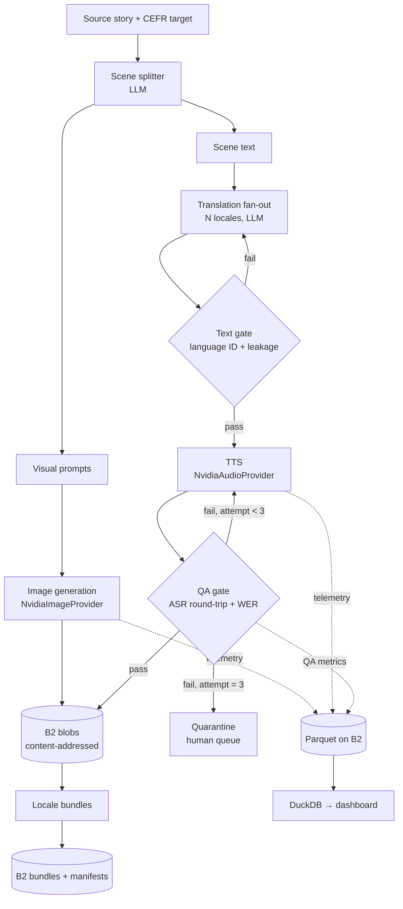

# 02 — Technical Architecture

## 1. System overview



**The load-bearing design decision:** images are generated once and referenced by every
locale bundle via SHA-256. Audio is the only per-locale artifact. Storage grows with
`locales × audio`, not `locales × (audio + images)`.

## 2. Components

| Component | Responsibility | Module |
|---|---|---|
| **Authoring** | Story → scenes → visual prompts | `polyglo/authoring.py` |
| **Visuals** | Scene → image, once, content-addressed | `polyglo/visuals.py` |
| **Localization** | Scene text → N locales, CEFR-preserving | `polyglo/localize.py` |
| **Narration** | Localized text → audio | `polyglo/narrate.py` |
| **QA gates** | Text gate + ASR round-trip gate | `polyglo/qa/` |
| **Store** | Content-addressed B2 blob store + bundles | `polyglo/store.py` |
| **Telemetry** | Parquet writes + DuckDB queries | `polyglo/telemetry.py` |
| **API** | FastAPI routes, SSE progress | `polyglo/api.py` |
| **UI** | Server-rendered pages + HTMX | `polyglo/templates/` |

Keep the module boundaries clean. If you later extract a general-purpose library, the
seam is `store.py` + `telemetry.py` + `qa/`.

## 3. Data model

```python
# polyglo/models.py
from dataclasses import dataclass, field
from enum import Enum

class QAStatus(str, Enum):
    PENDING     = "pending"
    PASS        = "pass"
    RETRIED     = "retried"      # passed, but not on first attempt
    QUARANTINED = "quarantined"  # failed all attempts, needs a human

@dataclass
class Scene:
    story_id: str
    ordinal: int
    source_text: str
    visual_prompt: str
    image_sha256: str | None = None   # shared across ALL locales

@dataclass
class LocalizedScene:
    story_id: str
    ordinal: int
    locale: str                        # BCP-47, e.g. "es-ES"
    text: str
    audio_sha256: str | None = None
    qa_status: QAStatus = QAStatus.PENDING
    wer: float | None = None
    attempts: int = 0
    transcript: str | None = None      # what ASR heard — needed for the diff UI
    voice_model: str | None = None     # which model finally succeeded

@dataclass
class Story:
    story_id: str
    title: str
    cefr: str                          # A1 | A2 | B1 | B2 | C1 | C2
    source_locale: str
    scenes: list[Scene] = field(default_factory=list)

@dataclass
class Bundle:
    story_id: str
    locale: str
    manifest_uri: str
    canonical_hash: str
    image_refs: list[str]              # sha256 list — shared blobs, not copies
    audio_refs: list[str]
```

Local index: **SQLite** (`polyglo.db`). Durable record: **B2**. SQLite is a cache that
can be rebuilt from B2 — never the source of truth.

## 4. B2 bucket layout

```
polyglo/
├── blobs/
│   └── <sha[0:2]>/<sha[2:4]>/<sha256>        # every asset, deduped by content
├── manifests/
│   └── <run_id>/manifest.json                # Genblaze manifests
├── bundles/
│   └── <story_id>/<locale>/bundle.json       # references blobs by hash
├── telemetry/
│   ├── runs/*.parquet
│   ├── steps/*.parquet
│   ├── assets/*.parquet
│   └── qa/*.parquet                          # our own table, see §8
└── quarantine/
    └── <story_id>/<locale>/<ordinal>.json    # failed segments + diagnostics
```

`bundle.json` stores **hashes, not copies**. That is what makes the dedup real rather
than cosmetic — and it is trivially provable by listing the bucket.

### Genblaze sink configuration

```python
from genblaze_core import ObjectStorageSink, KeyStrategy, ParquetSink
from genblaze_s3 import S3StorageBackend

storage = ObjectStorageSink(
    S3StorageBackend.for_backblaze("polyglo"),
    key_strategy=KeyStrategy.CONTENT_ADDRESSABLE,   # dedup happens here
    parquet_sink=ParquetSink("telemetry/"),
)
```

`KeyStrategy.CONTENT_ADDRESSABLE` deduplicates by SHA-256 prefix. This single argument is
most of the storage story — but you still need to *measure* the saving to make it a
demo (§8).

## 5. Pipeline stages

> **`[VERIFY]`** The Genblaze README shows `.run()` returning both a bare `result` and a
> `(run, manifest)` tuple in different examples. Confirm the actual signature in your
> first session and normalize a thin wrapper around it so the rest of the code is stable.

### 5.1 Scene splitting (chat)

```python
from genblaze_nvidia import chat

SPLIT_PROMPT = """Split this story into {n} scenes for a CEFR {cefr} language learner.
For each scene return: text (max 40 words, CEFR {cefr} vocabulary) and
visual_prompt (a concrete, culturally neutral illustration description).
Return strict JSON: {{"scenes":[{{"text":...,"visual_prompt":...}}]}}"""
```

Use a cheap chat model. Enforce JSON by parsing and retrying on failure — do not trust
the model to be well-formed.

### 5.2 Visuals — generated once

```python
from genblaze_core import Pipeline, Modality
from genblaze_nvidia import NvidiaImageProvider

def generate_scene_image(scene: Scene, storage):
    return (
        Pipeline(f"visual-{scene.story_id}-{scene.ordinal}")
        .step(
            NvidiaImageProvider(),
            model="stabilityai/stable-diffusion-3-5-large",
            prompt=scene.visual_prompt,
            modality=Modality.IMAGE,
            fallback_models=["black-forest-labs/flux.2-klein"],   # [VERIFY] model IDs
        )
        .run(sink=storage, timeout=180)
    )
```

Called **once per scene**, never per locale. This is the whole point.

### 5.3 Localization fan-out

Translate all scenes into all locales. Use `abatch_run()` or `asyncio.gather` over chat
calls. Preserve CEFR level explicitly in the prompt — literal translation drifts upward
in difficulty, which silently breaks the product.

### 5.4 Narration

```python
from genblaze_nvidia import NvidiaAudioProvider

def narrate(ls: LocalizedScene, storage, voice_model: str):
    return (
        Pipeline(f"tts-{ls.story_id}-{ls.locale}-{ls.ordinal}")
        .step(
            NvidiaAudioProvider(),
            model=voice_model,                # Riva TTS  [VERIFY] exact model IDs
            prompt=ls.text,
            modality=Modality.AUDIO,
            language=ls.locale,
            fallback_models=[FALLBACK_VOICE],
        )
        .run(sink=storage, timeout=120)
    )
```

## 6. The QA gate — detailed spec

This is the differentiator. Specify it precisely or it will be hand-wavy in the demo.

### 6.1 Interface

Two implementations behind one interface, because the ASR path is the build's main risk
(see [03 — Build Plan](03-BUILD-PLAN.md) §Risks).

```python
# polyglo/qa/asr.py
from typing import Protocol

class Transcriber(Protocol):
    def transcribe(self, audio_path: str, locale: str) -> str: ...

class NvidiaChatTranscriber:
    """NvidiaChatProvider accepts audio input. Keeps everything inside Genblaze."""

class GeminiTranscriber:
    """Direct google-genai call. Gemini has native audio understanding.
    Outside Genblaze, but the QA gate is a validation stage, not a generation stage —
    so this costs us nothing on the 'Use of Genblaze' criterion."""
```

Spike **both** on Friday. Keep whichever works; the interface means the choice is a
one-line change.

### 6.2 Normalization (do this before comparing — it is where naive implementations fail)

```python
def normalize(text: str, locale: str) -> str:
    text = unicodedata.normalize("NFKC", text).casefold()
    text = expand_numerals(text, locale)   # "3" -> "tres"  — ASR spells numbers out
    text = strip_punctuation(text)         # keep intra-word apostrophes/hyphens
    return " ".join(text.split())
```

Skipping numeral expansion alone will produce false failures on most sentences containing
digits. Budget real time for this function; it is small but fiddly.

### 6.3 Scoring

```python
wer = levenshtein_words(normalize(expected), normalize(actual)) / len(expected_words)
```

| WER | Verdict |
|---|---|
| ≤ 0.10 | **PASS** |
| 0.10 – 0.25 | **RETRY** — different voice, same model family |
| > 0.25 | **ESCALATE** — stronger model, then quarantine |

> **`[VERIFY]`** These thresholds are a starting point, not a result. Calibrate against
> ~20 known-good samples on Saturday. A threshold that never fires makes the gate
> theatre; one that always fires burns your credit budget on retries.

### 6.4 Escalation policy

```
attempt 1: primary voice          → fail →
attempt 2: alternate voice        → fail →
attempt 3: fallback model family  → fail →
           QUARANTINE + write diagnostics to B2 + surface in review queue
```

Record every attempt in the QA telemetry table. **The retry history is the demo** —
a gate that always passes on attempt 1 proves nothing to a judge.

### 6.5 Text gate (cheap, runs first)

Before spending TTS credits: detect the language of the translated text and reject if it
does not match the target locale, or if source-language segments leaked through. Catches
the most common LLM translation failure for a fraction of a cent.

## 7. Provenance

```python
manifest.canonical_hash    # deterministic hash over the whole run
manifest.manifest_uri      # B2 location
manifest.verify()          # validates hash + every asset sha256
```

Embed manifests into audio files where the handler supports it, and always write the
JSON sidecar. The UI needs a **verify-on-upload** widget: drop a file in, extract, verify,
show green. That closes the provenance loop visually in about four seconds of demo time.

> **`[VERIFY]`** Confirm which audio handlers exist (`Mp3Handler` / `WavHandler`). The
> README confirms `Mp4Handler` and lists mp3/wav as embeddable formats, but the exact
> class names are unconfirmed. Sidecar JSON is the fallback and is always sufficient.

## 8. Telemetry

Genblaze's `ParquetSink` gives you run/step/asset tables free. Add one table of your own:

```
telemetry/qa/*.parquet
├── story_id, locale, ordinal
├── attempt          int
├── voice_model      str
├── wer              float
├── status           str      # pass | retried | quarantined
├── latency_ms       int
└── ts               timestamp
```

### Dashboard queries (DuckDB over B2)

```sql
-- Dedup saving: the headline number
SELECT
  count(*)                                        AS total_refs,
  count(DISTINCT sha256)                          AS unique_blobs,
  1 - count(DISTINCT sha256)::float / count(*)    AS dedup_ratio
FROM read_parquet('s3://polyglo/telemetry/assets/*.parquet');

-- QA gate effectiveness
SELECT status, count(*), round(avg(wer), 3) AS avg_wer
FROM read_parquet('s3://polyglo/telemetry/qa/*.parquet')
GROUP BY status;

-- Cost and latency by model
SELECT model, count(*) AS calls, sum(cost) AS spend, quantile(latency_ms, 0.95) AS p95
FROM read_parquet('s3://polyglo/telemetry/steps/*.parquet')
GROUP BY model;
```

DuckDB reads Parquet directly from S3-compatible storage — point it at the B2 endpoint.
`[VERIFY]` the httpfs config against B2's S3 endpoint early; it is usually fine but worth
five minutes.

## 9. API surface

```
POST  /api/stories                    create story, kick off pipeline
GET   /api/stories/{id}               status + scene/locale matrix
GET   /api/stories/{id}/events        SSE progress stream
GET   /api/bundles/{id}/{locale}      bundle JSON
POST  /api/verify                     upload a file → extract manifest → verify
GET   /api/dashboard                  dedup / QA / cost aggregates
POST  /api/chaos/{provider}/disable   failover demo toggle
```

`/api/chaos` exists purely to make the fallback chain demonstrable on camera. It is a
legitimate testing affordance — keep it, and mention it is deliberate.

## 10. Stack and deployment

| Layer | Choice | Why |
|---|---|---|
| Language | Python 3.11+ | Genblaze is Python |
| Pipeline | `genblaze[nvidia]` + `genblaze-s3` | Required by the hackathon |
| API | FastAPI | Async fits the fan-out; SSE is easy |
| UI | Jinja2 + HTMX | No build step, no npm, fast to ship |
| Index | SQLite | Zero setup, rebuildable from B2 |
| Analytics | DuckDB | Reads Parquet straight from B2 |
| Audio/text utils | `pydub`, `jiwer` or hand-rolled WER | Small, no heavy deps |
| Deploy | Hugging Face Spaces (Docker) | Free, public URL, no credit card |

**Deployment matters** — "functional, publicly accessible app" is a submission
requirement. Render's free tier also works but cold-starts; HF Spaces is more predictable
for a judge clicking a link.

## 11. Failure modes and responses

| Failure | Response |
|---|---|
| TTS model unavailable | Genblaze `fallback_models` chain |
| ASR unavailable | QA gate degrades to `PENDING`, pipeline continues, UI shows "unverified" |
| Translation returns source language | Text gate rejects before TTS spend |
| NVIDIA credits exhausted | Cache serves everything already generated; UI shows a clear banner |
| B2 upload failure | Retry with backoff; keep local copy until confirmed |
| Malformed JSON from chat model | Parse-and-retry with a repair prompt, max 2 attempts |

Every one of these should be *visible* in the UI rather than silent. Graceful degradation
that the user can see is a production-readiness signal; silent failure is the opposite.
